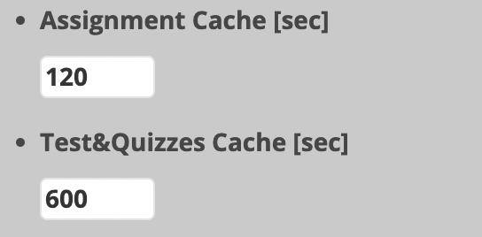

# Fetch Cache Time
Comfortable Sakai uses REST API to get published Assignments and Quizzes.  
You can visit **https://YOUR-SAKAI-LMS-ADDRESS/direct/** to see available APIs.

Since fetching Assignments and Quizzes every time the page is reloaded would put a load on the server,
we have decided to put some **Cache Time** for fetching these.

Default Cache Time is as follows:
- Assignments: **120** seconds
- Quizzes: **600** seconds

You can modify Cache Time from [miniSakai](#minisakai) Settings Tab.

