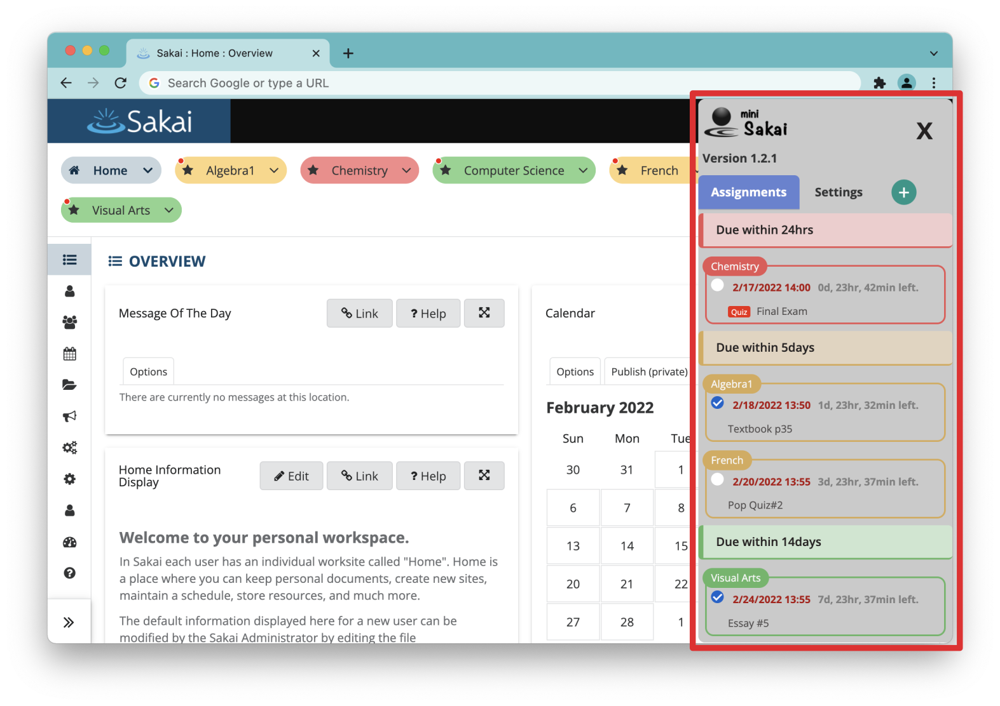
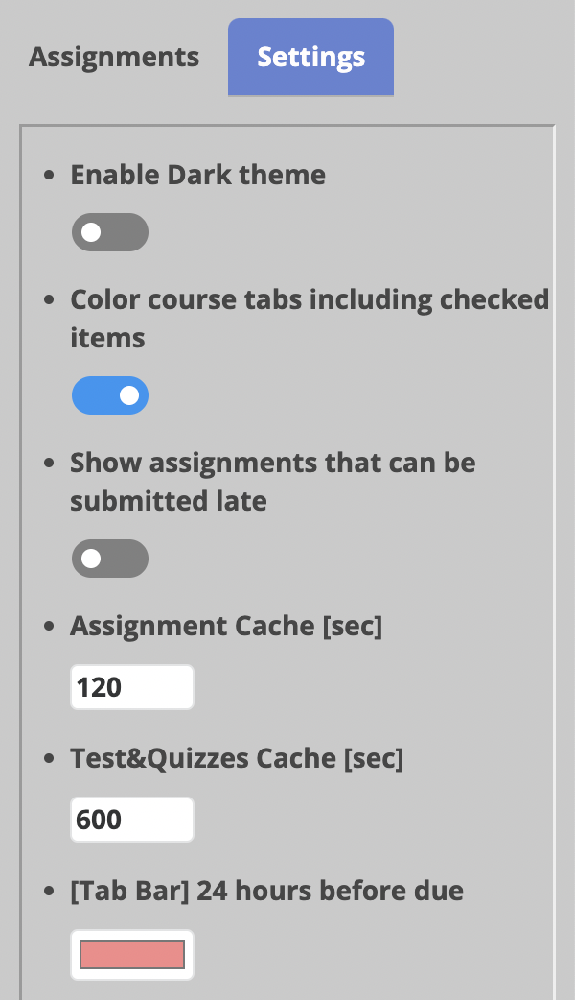

# miniSakai

**miniSakai** is a side panel that organizes **ALL** available Assignments and Quizzes.

## Assignment & Quiz Tab
Assignments and Quizzes are sorted and categorized by closest submission due date.

Category colors are the same as [Colored Course Site Tabs](#colored-course-site-tabs):
- 
  Due date within 1 Day
- 
  Due date within 5 Days
- 
  Due date within 14 Days
- 
  Due date over 14 Days

On the left side of the assignment information, there is a checkbox. You can use this checkbox to manage the status of your Assignment/Quiz submissions.

## Settings Tab

{:height="50px"}
