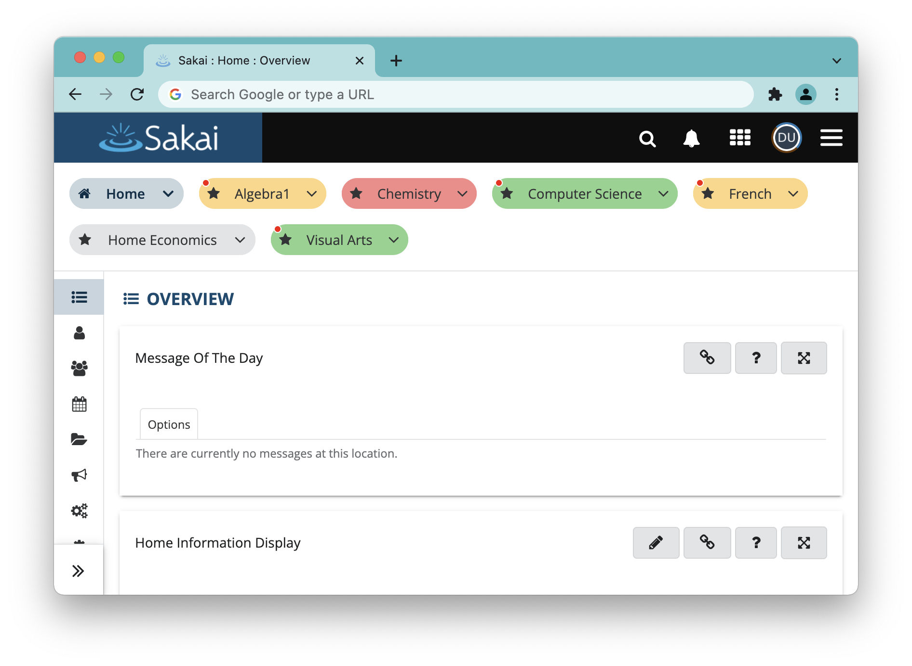

# Features


## Colored Course Site Tabs
Comfortable Sakai colors course site tabs according to the due date of assignments and quizzes
that are available.


There are largely 4 different color categories:

- 
  Due date within 1 Day
- 
  Due date within 5 Days
- 
  Due date within 14 Days
- 
  Due date over 14 Days

Color categories are determined by intuitive and easy-to understand for users.

## Add a Version Dropdown

To navigate seamlessly across versions, add a version dropdown.

Modify the `docusaurus.config.js` file:

```js title="docusaurus.config.js"
module.exports = {
  themeConfig: {
    navbar: {
      items: [
        // highlight-start
        {
          type: 'docsVersionDropdown',
        },
        // highlight-end
      ],
    },
  },
};
```

The docs version dropdown appears in your navbar:

## Update an existing version

It is possible to edit versioned docs in their respective folder:

- `versioned_docs/version-1.0/hello.md` updates `http://localhost:3000/docs/hello`
- `docs/hello.md` updates `http://localhost:3000/docs/next/hello`
